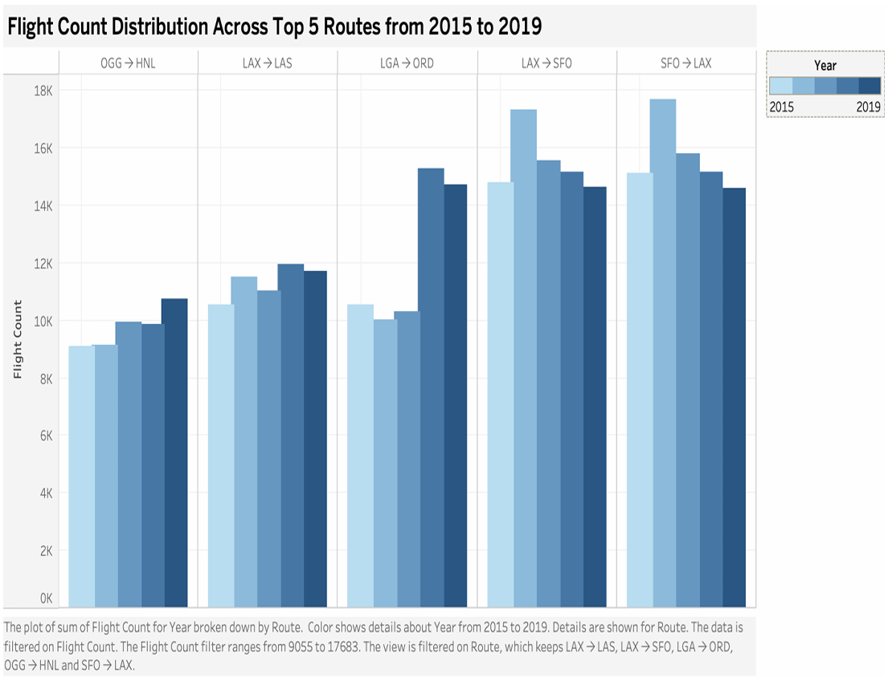

# Tableau Dashboard – Flight Traffic Trends

This folder contains the Tableau workbook used to visualize the **Top 5 busiest flight routes** (2015–2019) from the processed dataset.

---

## 📄 File
- **`flight_traffic_trends_dashboard.twbx`** – Packaged Tableau workbook with pre-built charts.

---

## 📊 Dashboard Features
- **Top 5 busiest flight routes** over time (stacked bar chart by year)
- **Year-on-year comparison** of route activity
- **Color-coded routes** for easy distinction
- **Tooltips** with route name, year, and flight count

---

## ⚙️ How to Use
1. Download the `.twbx` file to your computer.
2. Open it in **Tableau Desktop** or **Tableau Public**.
3. If using `.twb` (not packaged), replace the data source with:
   - Processed CSV: `data/processed/top_routes_2015_2019.csv`

---

## 📷 Dashboard Preview

  

---

## 📌 Notes
- The dashboard is built to work with the output generated by:
  - `src/flight_traffic_trends.ipynb` (Google Colab notebook)
- Colors, titles, and layout can be customized in Tableau as needed.
